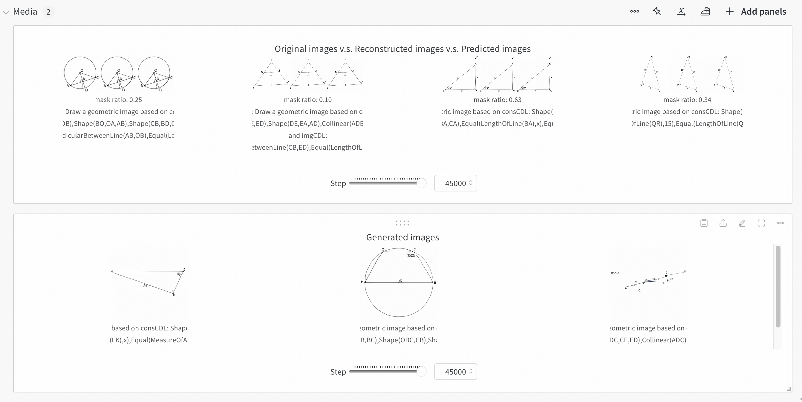
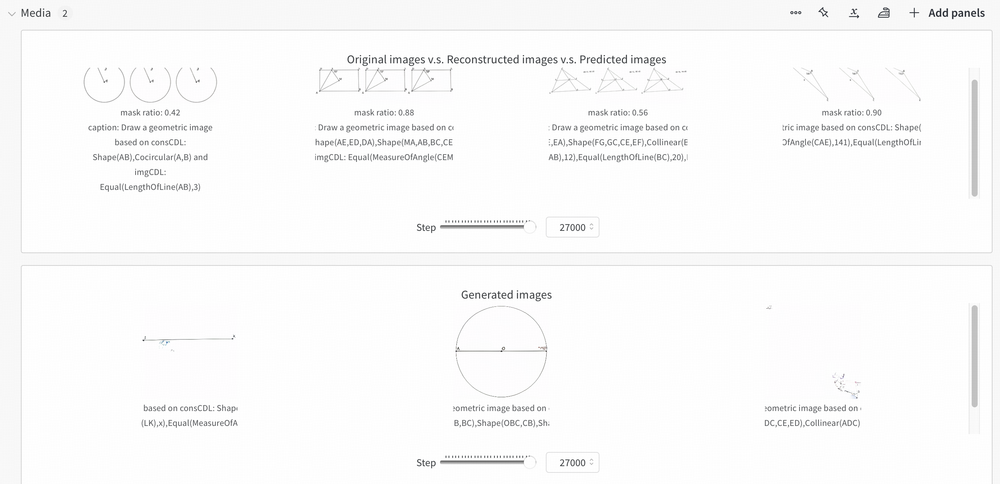
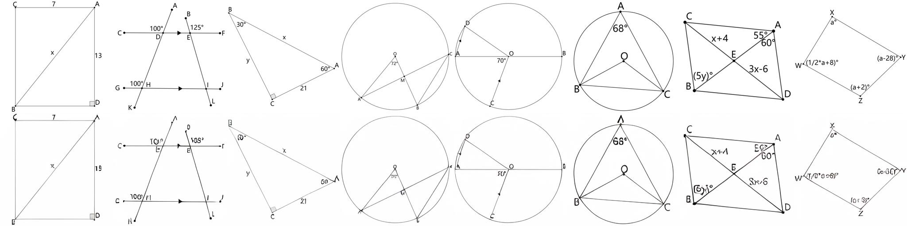
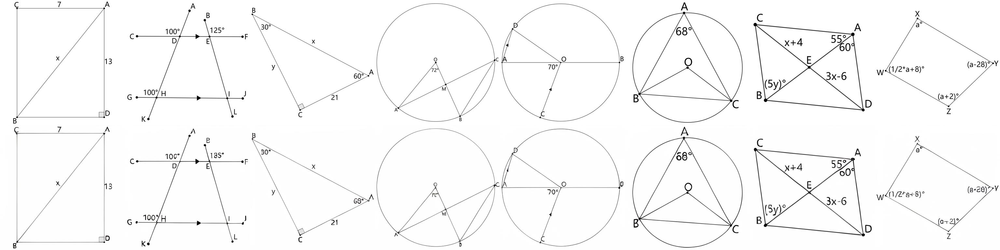
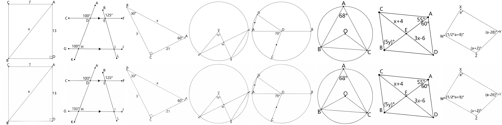

# 基于Qwen的多模态几何生成模型

# 环境安装
```shell
pip3 install -r requirements.txt
```
可以验证一下apex是否安装成功
```python
import apex
```
有时候由于torch版本太高导致apex无法成功安装


# 预训练模型下载

```shell
export HF_ENDPOINT=https://hf-mirror.com
# VQVAE
huggingface-cli download --resume-download Qwen/Qwen2.5-0.5B
```

# 预训练模型推理
单卡A800随便推，我把WANDB设置成了offline模式，不需联网

## 图像生成
这里利用作者预先[设定的几个prompts](validation_prompts/showoprompts.txt)生成图像, 保存在项目目录的wandb文件夹下
```shell
python3 inference_t2i.py config=configs/showo_demo_512x512.yaml \
batch_size=1 validation_prompts_file=validation_prompts/showoprompts.txt \
guidance_scale=5 generation_timesteps=50 \
mode='t2i'
```

## MMU
这里对作者预设的文件夹[./mmu_validation](./mmu_validation)下的图像，连续问两个问题(多轮对话)
- Please describe this image in detail.
- Do you think the image is unusual or not?
```shell
python3 inference_mmu.py config=configs/showo_demo_512x512.yaml \
max_new_tokens=100 \
mmu_image_root=./mmu_validation question='Please describe this image in detail. *** Do you think the image is unusual or not?'
```


# 模型训练
作者原始使用了三阶段训练，我这里小改了一下训练代码[./training/train.py](training/train.py) -> [training/finetuning.py](training/finetuning.py), 重新写了个简单的dataset[training/custom_data.py](training/custom_data.py)，并新增了从showlab/show-o和showlab/show-o-512x512预训练ckpt出发进行ft的config
- [configs/showo_finetuning.yaml](configs/showo_finetuning.yaml)
- [configs/showo_finetuning_512x512.yaml](configs/showo_finetuning_512x512.yaml)

```shell
# 使用4卡A800, deepspeed zero2训练
sbatch train_512.slurm
```

其他训练配置
```shell
# 单卡A800
accelerate launch --config_file accelerate_configs/1_gpu.yaml --main_process_port=8888 training/finetuning.py config=configs/showo_finetuning_512x512.yaml

# 4卡
accelerate launch --config_file accelerate_configs/4_gpus_deepspeed_zero2.yaml --main_process_port=8888 training/finetuning.py config=configs/showo_finetuning.yaml
```


## 目前的效果
- showlab/show-o (256分辨率)，此时的image token数为256，学习难度不高，但是问题是图像不清晰

    
    
- showlab/show-o-512x512，此时image token数为1024, 很难拟合

    


# 原始预训练VQ-VAE重建能力

```
CUDA_VISIBLE_DEVICES=0 python test_vq_model.py
```

- 在512分辨率下重建能力还可以接受，256文字看不清
- showlab/magvitv2支持多分辨率重建(CNN)，spatial 16x 压缩 


## 256


## 384



## 512



